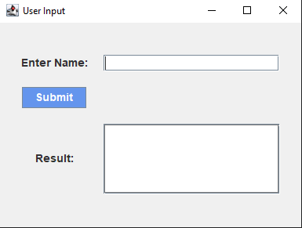
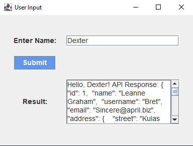
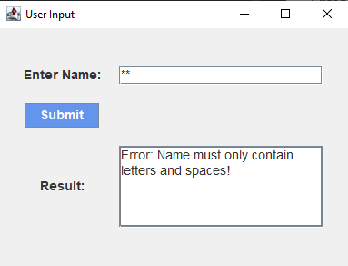
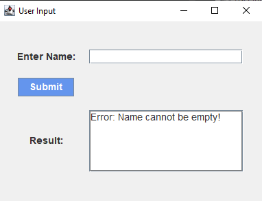

# D3 README

## Task Description
I can use the concept of delegation according to a description.(For example clear distinction between user input and logic, or using an external API to do a job.) I can also include exception handling(ie. My own exception classes) to handle wrong user input.

## Goal
To create a demonstration, we will a user form which then delegates the functionality of calling the RESTful API to another class to receive data.

## Tools

These are the tools we'll be using for this task:

- Java AWT (Abstract Window Toolkit) - Used to create a GUI Application
- Java IO (Input Output) - Package for input-output operations
- Java Net (Network) - For network applications

## Result
To test this program out, simply run the main method within the "GUI" class.

### Empty Input Field

### Successful Fetch w/ API data

Pressing submit returns your name along with data from the API. We're using showing arbitrary data from this API: https://jsonplaceholder.typicode.com/users/1

### Error Handling (Special Characters & Empty Field)

