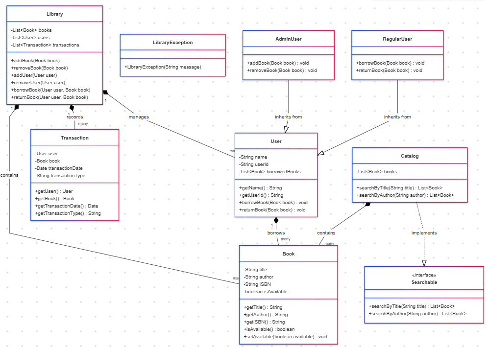

# Book Library Management System w/ Java (Angela)

## Description
This system manages books and their associated data, 
allowing users to borrow and return books. 
It utilizes a combination of classes, interfaces, and abstract classes to demonstrate various OOP concepts.

## UML Class Diagram

## UML Sequence Diagram (For one Use Case)

This diagram is for the use case of a Regular User borrowing a book from the library.